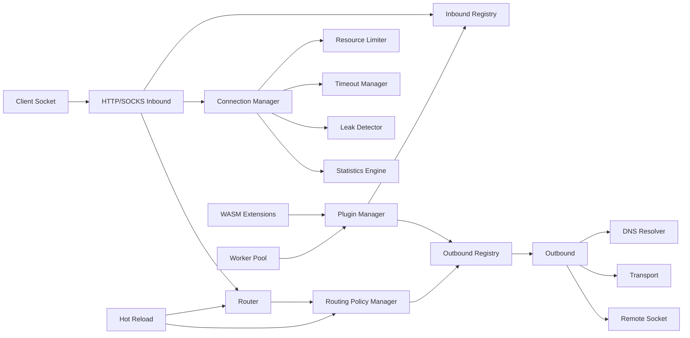

# Architecture

sepigs is organized around inbound, router, outbound, and transport boundaries.

## Core Flow

1. An inbound accepts a client socket and parses only the protocol handshake or proxy request metadata.
2. The inbound creates a `ProxyRequest` containing protocol, network, source, destination, and connection id.
3. The engine asks the router for an outbound or policy tag.
4. The routing policy manager expands policy tags into real outbound candidates and records latency/failure health.
5. The selected outbound opens or rejects the TCP connection. If a policy candidate fails, the engine tries the next candidate.
6. The inbound writes the protocol success or failure response, then pipes the client and remote sockets.
7. For SOCKS5 UDP ASSOCIATE, the inbound binds a per-association UDP relay socket and calls the outbound UDP method for each datagram.
8. `StatsTracker` records active connections, closed connections, failures, TCP byte counters, UDP packet counters, and UDP byte counters.

## Modules

- `src/core`: engine orchestration, lifecycle, and stats.
- `src/core/connectionManager.ts`: active connection registry, forced close, byte accounting, and timeout-driven recycling.
- `src/core/connectionPool.ts`: bounded idle TCP stream pool for reusable control-plane connections.
- `src/core/resourceLimiter.ts`: maximum active connection guard.
- `src/core/timeout.ts`: tracked timers used by connection lifecycle and periodic leak reporting.
- `src/core/leakDetector.ts`: tracked socket, timer, and listener snapshots.
- `src/config`: JSON loading, normalization, and validation.
- `src/config/hotReload.ts`: debounced config and rule-set file watcher.
- `src/inbound`: HTTP and SOCKS5 server implementations.
- `src/outbound`: direct, block, and tcpRelay outbound implementations.
- `src/outbound/registry.ts`: outbound factory registry. Adding an outbound does not change router logic.
- `src/plugin`: dynamic ESM plugin loading and WASM extension management.
- `src/dns`: DNS resolver abstraction and system resolver.
- `src/subscription`: subscription parser for outbound definitions.
- `src/router`: rule compilation, matching, policy selection, failover, load balancing, and latency health.
- `src/transport`: TCP exports, UDP datagram helpers, zero-copy relay, and QUIC transport interface.
- `src/workers`: worker-thread pool for CPU-oriented extension tasks.
- `src/protocol`: shared request and address types.
- `src/logger`: scoped log levels.
- `src/utils`: socket helpers and typed errors.

## Resource Model

Each accepted TCP control socket is counted once. After a TCP outbound is connected, sepigs uses `socket.pipe()` in both directions and records byte counts from lightweight data listeners. Cleanup destroys both sockets, removes listeners, and decrements active connection state exactly once.

SOCKS5 UDP ASSOCIATE uses a per-association UDP socket tied to the TCP control connection. Closing or timing out the control connection closes the UDP relay. Direct UDP currently sends one datagram and waits for one response with a bounded timeout.

## Extension Points

New protocols should implement `Inbound` or `Outbound` and register a factory. Built-in and plugin protocols share the same registry path. Plugin protocol types must use the `plugin.*` namespace, for example `plugin.myOutbound`.

Rule-set files are expanded by `config/loader.ts` before the router is constructed, so the runtime router still matches in-memory rules only.

GeoIP and GeoSite entries are also expanded into ordinary `ipCidr` and `domainSuffix` rules during config parsing. The runtime router has no protocol or geo special cases.

Routing policies are intentionally separate from router matching. The router returns a tag; the policy manager decides whether that tag is already a real outbound or a policy that should be expanded into candidates. This keeps new load-balancing and failover behavior from changing rule semantics.

QUIC is represented as a transport interface plus an unavailable default implementation. A plugin can provide a real implementation later without changing inbound, outbound, or router contracts.
